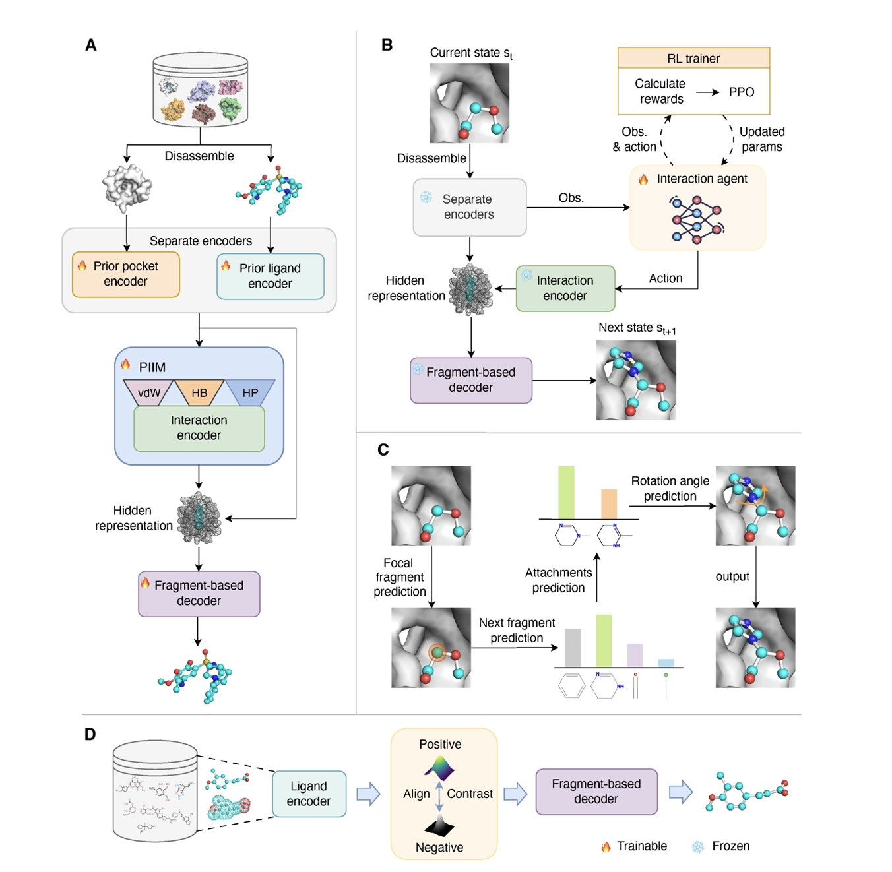

# [Briefings in Bioinformatics] AMG
:boom: The official repository of our paper "Deep reinforcement learning as an interaction agent to steer fragment-based 3D molecular generation for protein pockets". 

<p align="center">
   
</p>

## Prerequisites
:star2: We have presented the conda environment file in `./environment.yml`.

:star2: We have evaluated our models using external tools, including: [Qvina](https://qvina.github.io/), [Pyscreener](https://github.com/coleygroup/pyscreener).

## Install via Conda and Pip
```
conda create -n AMG python=3.7
conda activate AMG
conda install pytorch==1.13.1  pytorch-cuda=11.7 -c pytorch -c nvidia
conda install -c conda-forge pdbfixer
conda install conda-forge::openbabel

pip install tensorboard==1.15.0
pip isntall protobuf==3.19.6
pip install networkx==2.6.3
pip install rdkit==2023.3.2
pip install biopython==1.81
pip install pyscreener==1.1.1
pip install -U "ray[default]"

cd ADFRsuite_x86_64Linux_1.0
./install.sh -d myFolder -c 0

cd spinningup
pip install -e .
```


## Dataset
:star2: We pre-trained our model using the natural product dataset [COCONUT](https://coconut.naturalproducts.net) and the Pocket3D dataset collected from the [Protein Data Bank](https://www.rcsb.org/). The dataset used for fine-tuning was obtained from [CrossDocked2020](https://bits.csb.pitt.edu/files/crossdock2020/).

 :star2: To facilitate your implementation, we have provided the raw datasets used by AMG. Download the dataset archive from [AMG-DATA](https://drive.google.com/drive/folders/1YmqKfIDiDWkRVJGGcoPtCVPwhMPSHi2E).

## Training
Ligand encoder and fragment-based decoder pre-training:
```
python scripts/pretrain_ligand.py  
```

Pocket encoder pre-training:
```
python scripts/pretrain_pocket.py
```

The first training stage:
```
python scripts/train_rec.py
```

The second training stage:
```
python scripts/train_agent.py
```

## Sampling
```
python scripts/sample_testset.py --config configs/rl.yml --start_index 0  --end_index 99 
```

## Evaluation
### Evaluation from sampling results
```
python scripts/evaluate_amg.py
```

### Evaluation from meta files
We provide the sampling results of our model and Pocket2Mol, TargetDiff, DecompDiff, ResGen, FLAG baselines [here](https://drive.google.com/drive/folders/1Gk4WFUiIQsp2UKT9dMI4OVljbIzzDZJs).

You can directly reproduce the results reported in the paper quickly with [summary.ipynb](https://github.com/ispc-lab/AMG/blob/main/notebooks/summary.ipynb).
